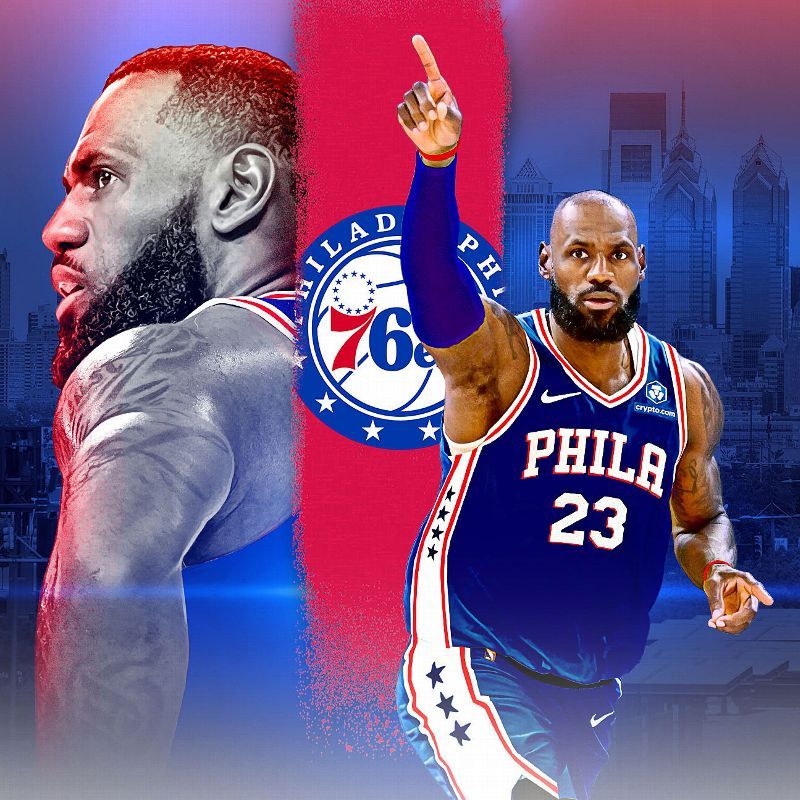
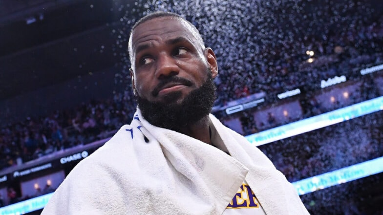

作为一个从骑士时期就开始看老詹的球迷，这个夏天的心情跟过山车一样。赛季结束他暗示可能退役，我一度以为看一场少一场了。结果自由市场一开，他宣布加盟 76 人——第 24 个赛季，穿上了费城的 23 号。

冷静下来之后，我发现这笔签约的信息量比想象中大得多。合同、阵容、东部格局，每一环都值得拆开看看。

## 合同：史无前例的降薪

LeBron 签的是 2 年 800 万美元的老将底薪合同，含球员选项和 15% 的交易保证金。2026-27 赛季他只能拿到 3,876,529 美元——比他新秀赛季（2003-04 赛季的 4,018,320 美元）还少。

作为对比，他上赛季在湖人拿了接近 5300 万美元。

*图片来源：[ESPN](https://www.espn.com/nba/story/_/id/49440164/lebron-chooses-76ers-sign-2-year-8-million-contract)*

降薪的逻辑不复杂：76 人的薪资空间已经锁死（恩比德 5780 万、布朗 5770 万、马克西 4080 万），只有底薪合同能塞得下他，同时给球队留下继续引援的操作空间。对 41 岁、已经有 4 冠的老詹来说，钱已经不是第一优先级了——他缺的是第 5 枚戒指，而 76 人开出了他眼中"最好的夺冠窗口"。

## 阵容：纸面上是 2K 自建球队

先看 76 人这个夏天做了什么。7 月 1 日，他们用 Paul George 加上两个首轮签（2028、2031）和两个次轮签，从凯尔特人换来了 Jaylen Brown——2024 年的总决赛 MVP，上赛季场均 28.7 分。这笔交易本身就已经足够震撼，LeBron 的到来让首发变成了：

| 球员 | 上赛季场均 | 球队 |
|------|-----------|------|
| Jaylen Brown | 28.7 分 / 5.1 助 / 6.9 板 | 凯尔特人（新援） |
| Tyrese Maxey | 28.3 分 / 6.6 助 / 4.1 板 | 76 人 |
| Joel Embiid | 26.9 分 / 3.9 助 / 7.7 板 | 76 人 |
| LeBron James | 20.9 分 / 7.2 助 / 6.1 板 | 湖人（新援） |
| VJ Edgecombe | 16.0 分 / 4.2 助 / 5.6 板 | 76 人 |

（数据来源：NBA.com 官方统计）

首发五人的上赛季场均得分加起来 120.8 分。ClutchPoints 的评价很到位：**"这套阵容在纸面上就是 2K 自建球队"**。

## 为什么是 76 人？

LeBron 整个夏天都在被各队招募，从媒体曝光来看，主要候选有这么几个：

- **勇士**：库里 + 追梦 + 老詹，情怀拉满，但阵容老化，西部还有雷霆和森林狼虎视眈眈
- **热火**：莱利时代的旧梦，但巴特勒已经离队，竞争力存疑
- **骑士**：回到梦开始的地方，剧本最感人，但薪资结构已经锁死
- **森林狼**：年轻有天赋，但夺冠窗口还没完全打开

76 人最终胜出的原因，ESPN 这篇[深度分析](https://www.espn.com/nba/story/_/id/49440496/answering-biggest-questions-lebron-james-philadelphia-76ers-jaylen-brown)说得很清楚：**这是所有选项里夺冠概率最高的那个**。

阵容上，布朗是三个级别的得分手，马克西的单打是防守者的噩梦，健康的恩比德是联盟低位最恐怖的存在——老詹不需要每场 40 分钟大包大揽，他只要做他最擅长的事：组织、串联、关键时刻接管。

而且别忘了，恩比德从 2014 年就开始（半开玩笑地）招募老詹了，两人还在 2024 年巴黎奥运会一起拿了金牌。这次终于成真，属于是"十年之约"了。

## 下赛季展望：东部怎么打

先看 76 人上赛季的位置：45 胜 37 负，东部第 7，首轮 3-4 惜败凯尔特人。防守效率联盟第 19，净效率 -0.2——不算差，但离争冠级别还有距离。

东部现在的格局是这样的（2025-26 赛季最终排名）：

| 排名 | 球队 | 战绩 | 备注 |
|------|------|------|------|
| 1 | 活塞 | 60-22 | 上赛季东部第一 |
| 2 | 凯尔特人 | 56-26 | Tatum 跟腱伤只打 16 场 |
| 3 | 尼克斯 | 53-29 | **上赛季总冠军** |
| 4 | 骑士 | 52-30 | 哈登加盟 |
| 7 | 76人 | 45-37 | LeBron 加盟 |

**凯尔特人**：最硬的对手。Tatum 伤愈回归后阵容完整，而且 Brown 的"旧东家恩怨"会让这个系列赛的对抗烈度直接拉满。对位上看，Tatum 防 LeBron、Brown 防 Tatum 的画面会很有戏——前提是布朗得先过掉自己的心态关。

**尼克斯**：卫冕冠军，Brunson 体系成熟，上赛季季后赛打出过 11 连胜的统治力。他们的优势是稳定，劣势是没有超级巨星级别的内线对位恩比德。

**骑士**：哈登加盟后进攻火力拉满，但防守是软肋。76 人打他们，关键是让 Embiid 在低位持续施压，把节奏拖进阵地战。

**活塞**：上赛季东部第一，年轻有冲劲，但季后赛经验不足。老詹在这种系列赛里的经验优势是压倒性的。

**隐患也是明摆着的**：一个球不够分。ESPN 的数据模型预测 Brown 场均得分会从 28.7 掉到 22.4-23.5，Maxey 从 28.3 掉到 22.0-23.2。匿名教练的质疑也很直接："谁去设置挡拆？谁去做脏活？谁来防守？"恩比德的膝盖更是悬在所有人头上的达摩克利斯之剑——他上赛季只打了 38 场。

Bob Myers（76 人母公司总裁）在 ESPN 采访里的一句话可能是最好的注脚：

> "如果这是关于赢球，那就聊聊这支球队吧。因为在费城，你真的能赢。"

## 最后

从球迷的角度，这笔签约让我心情复杂。一方面，老詹 41 岁还能让整个联盟为他改变格局，这件事本身就值得respect。另一方面，费城这套阵容的上限和下限都极端——要么一路打进总决赛拿下第 5 冠，要么因为球权、伤病和化学反应问题在第二轮就出局。

*图片来源：[NBA.com](https://www.nba.com/news/lebron-james-fourth-free-agency-decision-philadelphia-sixers)*

但作为看了他快 20 年的老球迷，我只想说一句：King，最后一舞，尽情享受吧。
