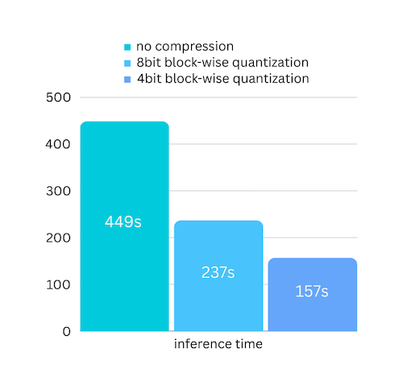
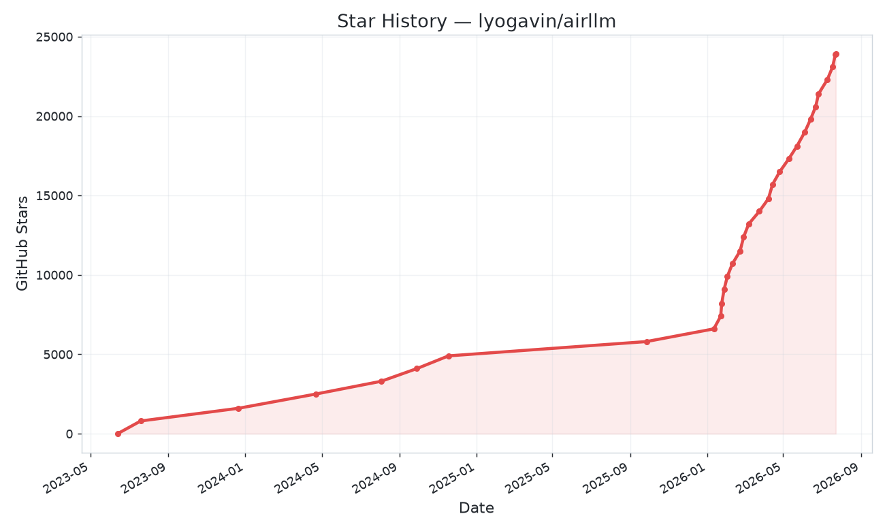
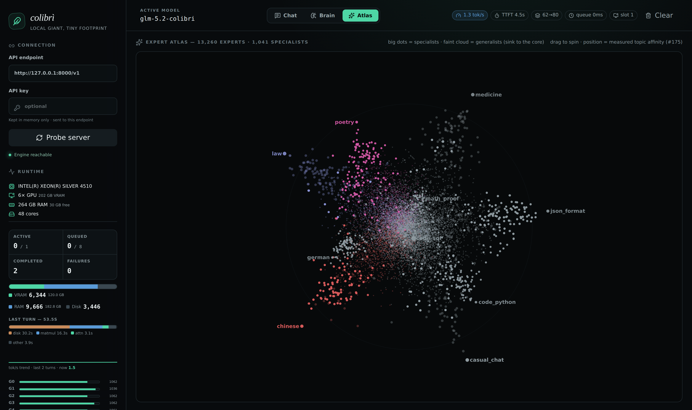
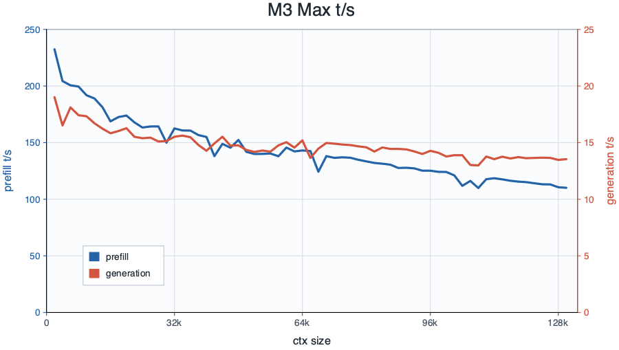

大模型的世界有个默认假设：**旗舰模型活在云端**。70B、400B、700B 的模型，似乎天生属于 GPU 机房。

但有一群人偏不这么想。这个假期我翻了不少开源项目，有三个特别有意思——它们用三种截然不同的方式，试图把"服务器级的模型"搬回"自己的电脑"：

- **AirLLM**：什么模型都能跑，但慢
- **Colibri**：只跑一个模型，但能在破烂机上跑
- **DwarfStar**：只跑一个模型，但跑到极致

表面上是三种路线，骨子里是同一场逆流——都在挑战那个默认假设。

## 三个项目速览

| 维度 | AirLLM | Colibri | DwarfStar |
|------|--------|---------|-----------|
| 作者 | [Gavin Li](https://github.com/lyogavin) | [JustVugg](https://github.com/JustVugg) | [antirez](https://github.com/antirez)（Redis 之父） |
| 发布时间 | 2023.11 | 2026.07 | 2026 |
| 实现 | Python + PyTorch | 纯 C 零依赖 | C + Metal/CUDA/ROCm |
| 切分粒度 | 按层（layer-wise） | 按 MoE 专家（expert-wise） | 按专家 + 要害保精度 |
| 目标设备 | 4GB 老显卡 | 25GB 破烂机 | 96GB+ Mac |
| Stars | [24.5k](https://github.com/lyogavin/airllm) | [21.8k](https://github.com/JustVugg/colibri) | [19.4k](https://github.com/antirez/ds4) |

## 路线一：AirLLM —— 用时间换显存

AirLLM 是这三个里面最早、也最出名的。它的核心洞察很简单：**Transformer 是逐层串行的，所以推理时一次只需要在 GPU 上放一层**。

传统的推理思路是把整个模型塞进显存，显存需求 = 模型总大小。AirLLM 换了个思路：显存需求 = 单层大小。一层算完就卸掉，换下一层。

[官方 README](https://github.com/lyogavin/airllm) 里有一张很直观的表：

| 模型 | 大小 | 所需显存 |
|------|------|---------|
| Qwen3 / Mistral / Phi | ~8B | ~1-2 GB |
| Qwen3-235B（MoE） | 235B | ~3 GB |
| Llama 3.x 70B（全精度） | 70B | ~4 GB |
| Llama 3.1 405B | 405B | ~8 GB |
| DeepSeek-V3 | 671B | ~12 GB |

而且全程只用一行代码：`AutoModel.from_pretrained("deepseek-ai/DeepSeek-V3")`，不需要针对模型做任何特殊处理。

[README](https://github.com/lyogavin/airllm) 里那张量化加速图很直观——无压缩 449 秒，8-bit 量化 237 秒，4-bit 量化 157 秒，接近 3 倍：

图片来源：<a href="https://github.com/lyogavin/airllm">AirLLM 官方 README</a>

这个项目最精彩的部分其实是它的**演进时间线**。从 [README 的更新记录](https://github.com/lyogavin/airllm#updates)可以清楚看到：

- **2023.11**：初版，70B 在 4GB 显卡上跑起来
- **2023.12**：支持 MacOS、AutoModel 自动识别模型、block-wise 量化带来 3x 加速
- **2024.07**：Llama 3.1 405B 在 8GB 上跑
- **2026.06**：v3.0 支持 FP8，DeepSeek-V3 671B 在 ~12GB
- **2026.07**：Kimi K3（2.8T，目前最大的开源模型）在 **3.72GB** 显存上跑起来

三年时间，从 70B/4GB 走到 2.8T/3.72GB。后面几个 MoE 模型能压到这么低，是因为稀疏 MoE 一次只流式加载一个专家，而不是整层——这已经是在往 Colibri 的方向靠了。

AirLLM 的火爆程度可以从 [star 历史曲线](https://star-history.com/#lyogavin/airllm&Timeline)看出来——2023 年发布后稳步爬坡，2026 年初突然加速，现在 24.5k stars：

图片来源：<a href="https://star-history.com/#lyogavin/airllm&Timeline">star-history.com</a>

当然代价也很明显：**慢**。层要从磁盘反复加载，PCIe 传输和硬盘 I/O 是瓶颈。LinkedIn 上有人算了笔账：70B 模型约 96 层，每层约 1.5GB，PCIe 4.0 传一层就要约 45ms，加计算时间，**大约 5 秒生成一个 token**。YouTube 上的实测视频说得更直白：单个 token 可能要 5 秒到 1 分钟不等，对比 ChatGPT 的 30-50 t/s，"就像用信鸽寄信一样等每一个字"。

Reddit 上的评价也很一致："possible but… going to be slow"。有一篇 [Towards AI 的实测文章](https://pub.towardsai.net/run-70b-llms-on-4gb-gpu-with-airllm-795185975f3b)作者本来准备花 $200 租云 GPU 跑一次 Llama 70B 推理测试，结果用 AirLLM 在 4GB 显卡上跑成了，但结论也明确：**这种方案适合离线批处理、研究、预算有限的实验，不适合实时交互**。

但它的意义不在于快。它证明了：**限制不是物理的，是设计的**。你以为需要 80GB 显存才能跑的模型，其实 4GB 就能跑——只是慢。

## 路线二：Colibri —— 用空间换空间

Colibri 是今年 7 月刚出的项目，上来就在 Hacker News 炸了：[Show HN 帖子拿了 937 分、240 条评论](https://news.ycombinator.com/item?id=48842459)。

作者的出发点特别朴素——他在 [Show HN 原文](https://news.ycombinator.com/item?id=48842459)里说：

> 我试了试 GLM 5.2，被它的能力惊到了，跟 Claude 或 GPT 差不多。然后我想：这玩意在我的破电脑上能跑吗？会不会 OOM？……我只是想让它跑起来，即使很慢。所以就有了 Colibrì。

一台 12 核、25GB RAM 的笔记本，跑 744B 的 GLM-5.2。听起来天方夜谭，但 Colibri 做到了。

它的核心洞察：**MoE 模型每个 token 只激活约 5.4% 的参数**。GLM-5.2 总共 744B 参数，但每个 token 实际只激活约 40B，其中真正随 token 变化的只有约 11GB 的 routed experts。

所以模型根本不需要"装进"内存——它只需要被"放置"：

- **dense 部分**（attention、共享专家、embedding，~17B 参数）以 int4 常驻内存，约 9.9GB
- **19,456 个 routed experts**（75 层 × 256 个）存在磁盘上（~370GB），按需流式加载，配 LRU 缓存 + 学习型热专家驻留

用作者的话说，这是"**针对权重的 JIT**"——编译器 JIT 不会编译整个程序，而是盯着实际运行的热路径；Colibri 对 744B 参数做同样的赌注：参数不是要持有的常驻状态，而是要在存储层级间按需调度的数据。

效果怎么样？看 [官方 benchmarks](https://github.com/JustVugg/colibri/blob/main/docs/benchmarks.md)：

| 设备 | 速度 |
|------|------|
| 25GB 开发机（作者起点） | 0.05-0.1 t/s（冷启动） |
| 128GB 纯 CPU 台式机 | ~1.8 t/s |
| 6× RTX 5090 全驻留 | 5.8-6.8 t/s |

注意第一行：**0.05-0.1 t/s，作者把它写在 README 第一屏**。这种把难看数字诚实摆出来的态度，在开源社区很少见，也很值得respect。

[官方 benchmarks 文档](https://github.com/JustVugg/colibri/blob/main/docs/benchmarks.md)里还有一整张社区实测表，都是用户跑出来的真实数字：

| 设备 | 关键配置 | 实测速度 |
|------|---------|---------|
| Apple M5 Max 128GB（CPU） | 默认，MTP off | 1.06 t/s |
| Apple M5 Max 128GB（Metal） | Metal on，warm pin 39.7GB | 1.83 t/s |
| Apple M5 Max 128GB（Metal，更大 pin） | 46.9GB pin | 2.06 t/s |
| Mac Mini M4 Pro 48GB（Metal） | Metal on，--ram 38 | 0.30 t/s |
| Ryzen AI 9 HX 370（Framework 13） | 128GB，int8 MTP | 0.37 t/s |
| Ryzen 9 9950X 123GB（PCIe3 SSD） | 默认 | 0.10 t/s |
| 同上，换 PCIe5 SSD（8.81 GB/s） | 换盘后 | **0.28 t/s** |
| Ryzen 7 9800X3D + RTX 5090（70GB） | MTP off，learned pin | 0.41-0.52 t/s |
| Ryzen 9 9950X3D + RTX 5090（121GB） | PCIe Gen5，O_DIRECT | 1.23 t/s |
| EPYC 7443 430GB RAM | 77.5GB pin，hit 98% | 1.00 t/s |
| 6× RTX 5090（作者主机） | 全驻留，CUDA pipe | 5.8-6.8 t/s |

这张表特别有信息量。**9950X 那对数据是最干净的对照实验**：同一台机器、同样的历史缓存，只换了硬盘——PCIe 3.0 到 PCIe 5.0，磁盘带宽 ×5.8，速度从 0.10 提到 0.28 t/s（×2.9），耗时分布从 66% 磁盘变成 57% 计算。这直接证明了解码的瓶颈在哪：**硬盘够快之后，瓶颈就轮到 CPU 算了**。

还有个反直觉的点：9800X3D + RTX 5090 的组合只有 0.41-0.52 t/s，而 128GB 纯 CPU 的 M5 Max 能到 1.83-2.06 t/s。作者在 [README](https://github.com/JustVugg/colibri) 里也强调过：**瓶颈在 RAM 大小，不在 GPU**。显卡的 VRAM 装不下专家集，GPU 只能闲着；反而是内存够大、能把热专家 pin 在内存里的机器更快。

还有个有趣的细节：HN 评论区有人吐槽 Colibri 的 README 里"honest"这个词用得太多了，说这是 AI 生成文本的标志。作者用 AI 协助开发这点倒也没藏着掖着。这个插曲挺真实——本地 AI 社区正在一边拥抱 AI 写代码，一边互相警惕 AI 味。

Colibri 的另一个亮点是它的**可视化**：网页面板里有个 "Brain" 页面，把 19,456 个专家当成一个活的皮层来显示——颜色代表存储层级（绿=VRAM、蓝=RAM、灰=磁盘），亮度代表路由热度，每个被路由到的专家都会闪白：

图片来源：<a href="https://github.com/JustVugg/colibri">Colibri 官方 README</a>

还有个 "Atlas" 页面，把 13,260 个实测过的专家按主题聚类成一个 3D 星系——诗歌、法律、中文、SQL 各自形成星座，通用专家沉在核心，拖拽就能旋转：

图片来源：<a href="https://github.com/JustVugg/colibri">Colibri 官方 README</a>

一个推理引擎把可视化做成这样，真的很用心——跑模型的间隙，盯着屏幕看哪几个专家在被反复点亮，还挺有观察显微镜的感觉。

## 路线三：DwarfStar —— 用专一换性能

如果说 AirLLM 和 Colibri 是"引擎适配所有模型"，那 DwarfStar 走的是完全相反的路：**刻意地窄**。

[antirez](https://antirez.com/news/165)（Redis 之父）写这个引擎，只为一个目标服务：DeepSeek V4 Flash。不是通用 GGUF runner，不为所有模型优化——就把这一个模型吃到极致。

他在博客里说得直白：["A few words on DS4"](https://antirez.com/news/165) 有 21.7 万阅读量，开头就是：

> 我没料到 DwarfStar 4 会火得这么快。显然，大家需要这种"单模型深度整合"的本地 AI 体验——准前沿模型 + 极端的非对称量化，让 96 或 128GB 内存就够跑。

"极端的非对称量化"是关键：DwarfStar 的 2-bit 量化**只压 routed experts**（up/gate 用 IQ2_XXS、down 用 Q2_K），而共享专家、投影、路由这些"要害"部分完全不动。所以 2-bit 量化下质量依然在线，agent 场景下工具调用也可靠。

官方 [README 的 speed 表](https://github.com/antirez/ds4#speed)（Metal 后端实测）：

| 机器 | 量化 | 预填充 | 生成 |
|------|------|-------|------|
| MacBook Pro M3 Max 128GB | q2 | 58.5 t/s | 26.7 t/s |
| MacBook Pro M5 Max 128GB | q2 | 87.3 t/s | **34.3 t/s** |
| MacBook Pro M5 Max · 长上下文 | q2 | 463.4 t/s | 25.9 t/s |
| Mac Studio M3 Ultra 512GB | q4 | 79.0 t/s | 35.5 t/s |
| DGX Spark GB10 128GB | q2 | 343.8 t/s | 13.8 t/s |

34 t/s 的生成速度，对比 Colibri 的 6.8 t/s 和 AirLLM 的 0.1-2 t/s，完全不是一个数量级。这就是"专一"的回报。

[官方 speed-bench](https://github.com/antirez/ds4/tree/main/speed-bench) 里还画了预填充/生成速度随上下文变化的曲线（以 M3 Max 为例）——可以看到预填充随上下文长度增长明显下降，而生成速度相对平稳，这是 KV cache 占带宽的典型特征：

图片来源：<a href="https://github.com/antirez/ds4/tree/main/speed-bench">DwarfStar 官方 speed-bench</a>

社区数据也很丰富。antirez 在[另一篇博客](https://antirez.com/news/167)里提到：**"M5 Max 128GB 能跑 DeepSeek v4 Flash，2-bit 量化，预填充约 500 t/s，解码约 35-40 t/s"**——比 README 数字还快，因为优化一直在推进。还有日本开发者写了 [12 天实测记录](https://note.com/ngc_shj/n/n505c3ea0f3f9)，专门跑 DGX Spark 上的 DwarfStar。社区在 [NVIDIA 论坛](https://forums.developer.nvidia.com/t/a-spark-to-beat-m5-ultra-and-a-megaspark-to-beat-2x-rubin-pro-6000/372947)上的讨论也验证了 DGX Spark（GB10）在预填充上的优势：1,723 t/s 的提示处理，解码 38.55 t/s。

antirez 还做了一件特别坦诚的事——在 README 里放了一段 [AI full disclosure](https://github.com/antirez/ds4#ai-full-disclosure)：

> 这个软件是在 GPT 5.5、5.6、Claude Fable 的大力协助下开发的，人类主导想法、测试和调试。我们公开说这件事，因为它塑造了项目怎么被构建。如果你不喜欢 AI 写的代码，这软件不适合你。

这句话让我印象很深。一个写了几十年 C 的老程序员，公开承认自己的代码有 AI 的功劳，还顺便感谢了 llama.cpp 和 GGML——这种工程诚实文化，值得所有项目学习。

哦对了，DwarfStar 还有个彩蛋功能：**dir-steering（方向转向）**。用 100 对提示词提取一个方向向量，运行时就能单向量控制模型行为——想让它简洁就简洁，想让它啰嗦就啰嗦，甚至能做概念移除。antirez 说他用 steering 直接把模型的拒答行为移除了。这种低秩的运行时编辑，比微调快得多，对可控生成这件事很有启发。

## 三条路线的进化谱系

把三个项目放一起看，能看出一条清晰的进化线：

**切分哲学的演进：**
- AirLLM：按层切（粗粒度）
- Colibri：按专家切（细粒度）
- DwarfStar：专家切 + 要害保精度（精细化）

**本地推理的三阶段：**
- 2023 年：**能跑**（AirLLM，70B 在 4GB 上，慢但能跑）
- 2026 年：**烂机上能跑**（Colibri，744B 在 25GB 笔记本上）
- 2026 年：**本地跑得爽**（DwarfStar，准前沿模型 34 t/s）

还有个共同的硬件悖论值得单独说：**瓶颈在 RAM 大小，不在 GPU**。Colibri 的社区实测里，9800X3D + RTX 5090（70GB RAM）只有 0.41-0.52 t/s，而 128GB 纯 CPU 的 M5 Max 能到 1.83-2.06 t/s——显卡装不下专家集，GPU 只能闲着。antirez 也公开说过 Mac Studio 512GB 这种"内存优先"方案的合理性。本地推理的真正瓶颈是内存带宽与容量，显卡反而排后面。

## 最后

三个项目，三个答案：通用但慢、专一但能跑在破烂机上、专一且跑到极致。没有谁对谁错，只有取舍。

AirLLM 证明了限制是设计出来的；Colibri 把"装不装得下"变成了"等不等得起"；DwarfStar 证明窄可以是优点——把 Redis 的专一哲学从数据库带到了 AI。

antirez 博客里还有一句话特别打动我：

> 这是我玩本地推理以来，第一次发现自己会把正经事交给本地模型而不是 Claude/GPT。

AI 太重要了，不能只是一个付费服务。这句话，大概是这三个项目存在的共同理由。
