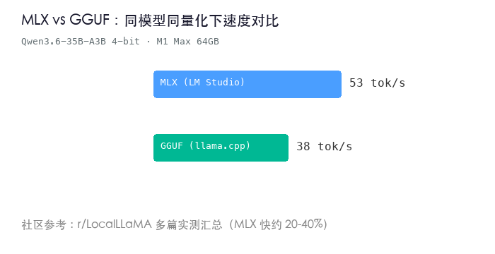
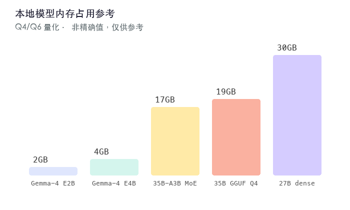

最近在 Mac 上折腾了不少本地 LLM，从选模型到跑 benchmark 到日常使用，踩了一些坑也摸出了些经验。写一篇记录一下，顺便给同样想在 Mac 上跑模型的人一个参考。

## 我的设备

MacBook Pro 2021，M1 Max（10+24），64GB 内存。M1 Max 的内存带宽大约 400 GB/s，这个数字很重要，因为 LLM 推理在 decode 阶段本质上是 memory-bandwidth-bound 的，不是算力瓶颈。也就是说，生成每个 token 时引擎要把模型权重几乎全读一遍，吞吐量取决于你读内存有多快，而不是 GPU 算多少 FLOPS。这正是 Apple Silicon 跑 LLM 的天然优势：CPU 和 GPU 共享同一块内存池，模型可以直接驻留在 GPU 可见的统一内存里，不需要像传统独立显卡那样在 CPU 内存和显存之间拷贝。

## 为什么跑本地

日常主要在用在线 API，速度快、能力也够。本地模型更多是用来兜底——处理一些不想往外发的东西、离线场景的应急、还有部分需要无审查输出的任务。目前的分工是 API 主力 + 本地辅助。

## 格式选择：MLX 还是 GGUF

这个问题我纠结过一阵子。GGUF 是 llama.cpp 生态的通用格式，社区模型多、兼容好、什么机器都能跑。MLX 是 Apple 自己的数组计算框架，只支持 Apple Silicon。

结论很明确：**在 Mac 上能选 MLX 就选 MLX。**

[LM Studio 官方](https://inventivehq.com/blog/running-llms-on-apple-silicon-mlx)称他们的 MLX backend 比 llama.cpp Metal 路径快 30–50%。[Atomic Chat 的对比文章](https://atomic.chat/blog/guides/gguf-vs-mlx)在 M1 Max 64GB 上实测发现 MLX 在 decode 阶段比 GGUF 快 20–40%。[一篇 arXiv 论文](https://arxiv.org/html/2605.00519v2)直接说"对于 ≥30B 的模型，MLX 4-bit 量化在 Apple Silicon 上提供了最佳吞吐量，没必要再测 GGUF"。[Reddit 上 M5 Max 128GB 的实测](https://www.reddit.com/r/LocalLLaMA/comments/1s0czc4/round_2_followup_m5_max_128g_performance_tests_i)也给出类似结论：同量化等级下 MLX 比 llama.cpp 快约 30%。

我自己跑下来的感受完全一致。同模型同量化等级，MLX 在首 token 速度上比 GGUF 快约 36%，连续工具调用的稳定性也好得多。LM Studio 从 v0.3.4 开始就原生支持 MLX 加载了，生态没什么障碍。

当然如果你需要在 Mac、Linux、Windows 之间共用同一个模型文件，GGUF 更通用。但如果你只用 Mac，没理由不选 MLX。

## 9 维度测试方法论

社区 benchmark 如 ARC-C、MMLU 这种大多是选择题，验的是"知不知道"，但实际用的时候真正重要的东西——能不能写好代码、能不能扮演角色、会不会在 Agent 循环里翻车——选择题往往验不出来。

所以我用九个类型的题目进行测试与横向对比：

| 题号 | 维度 | 测什么 |
|------|------|--------|
| Q1 | 编码 | Python LRU 缓存实现，要求 O(1) + 泛型 + 单元测试 |
| Q2 | 角色扮演 | 100 字内情感独白，要有语气符号和角色自觉 |
| Q3 | Agent | 多步工具调用 JSON 格式正确性 |
| Q4 | 逻辑推理 | 伪推理题，验思考严谨性 |
| Q5 | MoE 专家路由 | 物理概念、五绝平仄、日语敬语三项跨学科 |
| Q6 | 氛围描写 | 氛围刻画质量，考察细节表现力 |
| Q7 | 指令遵循 | 4 行×8 字、星号开头、英文+数字、主题限定 |
| Q8 | 深度推理 | 棋盘格染色问题，需要数学证明 |
| Q9 | 视觉识图 | 爱莉希雅主题壁纸图像检测 |

每题 0–10 分，总分 90，低于 70 的基本没法实际用。

这套测试肯定有局限——题少、覆盖窄、主观打分。但它能测到选择题测不到的东西，比如 Agent 稳定性、指令格式遵循、视觉的细节感知。后面所有模型都是同一套题，同一套打分标准。

## 实测对比：8 个模型

下面是在本地电脑上跑完所有题后的总排名：

| 排名 | 模型 | 总分 | 速度 | 稳定性 | 核心优势 | 致命短板 |
|------|------|------|------|--------|---------|---------|
| 1 | Qwen3.6-27B 官方原版 (MLX) | **91.0** | 13 t/s | 零事故 | 质量天花板，视觉/编码/推理全满分 | 慢 |
| 2 | Qwen3.6-35B-A3B Heretic MLX 4-bit | 79.0 | 53 t/s | Q7 循环 1 次 | 速度+质量平衡，Agent/视觉强 | 4-bit 量化偶发不稳定 |
| 3 | Qwen3.6-35B 官方原版 (MLX) | 77.5 | 54 t/s | 零事故 | 速度+质量平衡，Q7 满分 | 视觉略逊于 27B |
| 4 | Fable-Fusion-711 (GGUF) | 76.0 | 9 t/s | 零事故 | 氛围描写出色 | ARC-C 宣称冠军，实测第四 |
| 5 | Qwen3.6-35B GGUF HauhauCS | 73.0 | 47.5 t/s | Q3 循环 2 次 | 编码略优 | 日语语用错误，视觉弱 |
| 6 | Gemma-4 E4B (HauhauCS) | 63.0 | 44 t/s | 稳定 | 逻辑超强 | Q7 翻车，Q9 没认出角色 |
| 7 | Gemma-4 E2B (Heretic MLX) | 34.5 | 83 t/s | 快但逻辑崩 | 速度之王 | 逻辑崩溃，幻觉 |
| 8 | Supergemma4-26B Uncensored | DNF | — | 循环弃赛 | — | 全程循环，无法使用 |

几个关键发现：

**官方 vs 去审查版，质量差距是真实的。** 把 35B 官方原版、Heretic 去审查、HauhauCS 去审查放在同一张桌上对比，官方在总分、稳定性、视觉三项都明显领先。去审查会引入不稳定性——偶尔出现生成循环或者输出不够精确。不意外，但实测数据让这个判断更扎实。

**MoE 架构的速度优势巨大。** 35B-A3B 是 MoE 模型，激活参数只有 3B，所以 53 t/s 推理速度几乎和只有 2B 参与的 Gemma-E2B 一个量级。但质量几乎是密集 27B 的水平——这就是 MoE 的卖点。

**Fable-Fusion-711 的 ARC-C 0.711 宣称没有兑现。** 模型卡宣称超过 OpenAI/Claude 级别，实测总分 76 排第四，指令遵循还翻车了。ARC-C 只能测选择题推理，测不出 Agent 稳定性这些实际场景中的关键能力。

## 详细批改：35B 官方原版

拿 35B 官方版每道题展开看看，对这系列模型的实际表现有个直观感受：

| 题 | 得分 | 点评 |
|------|------|------|
| Q1 编码 | 8.0 | OrderedDict 实现正确，5 场景测试，但缺 `__len__` 和防御性校验。27B 的 `__slots__` 实现更优雅，差了那么一点工程美感 |
| Q2 角色扮演 | 9.0 | "失败只是下一次绽放的序曲"——有诗意，♪ 到位，150 字内，"爱莉希雅"自称自然出现 |
| Q3 Agent | 7.5 | 分两步 JSON，但第二步用了未定义变量 `py_files`（假设第一步已返回），逻辑链略松散 |
| Q4 逻辑推理 | 9.0 | 两种 case 完整，额外解释"为何不选其他盒子"，逻辑严密 |
| Q5 MoE 专家 | 9.0 | 物理准确（退相干≠坍缩）、五绝平仄完美、日语敬语标准，三项全对 |
| Q6 氛围描写 | 9.0 | 元素齐全，"夜露沾湿了衣角"氛围感强，"是归岸"结尾有诗意 |
| Q7 指令遵循 | 10 | 全场唯一满分。4 行/星开头/8 字/英文+数字/夜空主题，完美无缺 |
| Q8 深度推理 | 9.0 | 曼哈顿距离+奇偶性分析，比 27B 的坐标法略简洁但同样严谨 |
| Q9 视觉 | 8.5 | 认出角色和 logo，但没提"右眼俏皮微闭"这种细节，乐器描述也不够确定 |
| **总分** | **77.5** | |

和 27B 官方对比的话，差距集中在编码（8 vs 9.5）和视觉（8.5 vs 9.5）——27B 的代码实现更工程化、视觉细节更精准。但 35B 在速度上 4 倍于 27B，权衡看需求。

## 内存占用参考

64GB 统一内存，模型参数、系统、其他应用都共享。实测几个典型模型量化后的内存占用：

- Qwen3.6-27B MLX（近全精度）：约 28-32GB
- Qwen3.6-35B-A3B Heretic MLX 4-bit：约 16-18GB
- Qwen3.6-35B GGUF Q4：约 18-20GB
- Gemma-4 E4B（4B 参数）：约 3-4GB
- Gemma-4 E2B（2B 参数）：约 1.5-2GB

27B 全精度能跑，但跑完之后系统空闲内存不多了。如果要同时开 IDE、浏览器或者其他服务，4-bit 量化版更稳。35B-A3B 因为 MoE 特性反而比 27B 密集版还省内存，体验也快得多。

小一点的模型如 Gemma E4B / E2B 门槛很低，16GB 内存的 Mac 也能跑。但实测下来 E4B 逻辑强但指令遵循弱，E2B 逻辑直接崩。小模型现阶段还是不够用，除非你的任务真的很简单。

## 官方 vs 去审查：数据说话

去审查模型一直是个有争议的话题。我把同一基座（Qwen3.6-35B）的官方版和两个去审查版本放一起对比，结论很清晰：

| 维度 | 官方 27B | 官方 35B | Heretic 35B | HauhauCS 35B |
|------|---------|---------|------------|------------|
| 总分 | 91.0 | 77.5 | 79.0 | 73.0 |
| 速度 | 13 t/s | 54 t/s | 53 t/s | 47.5 t/s |
| 稳定性 | 零事故 | 零事故 | 1 次循环 | 2 次循环 |
| 视觉 | 9.5 | 8.5 | 9.0 | 7.5 |

Heretic 比 HauhauCS 高 6 分，稳定性也好一些（1 次循环 vs 2 次）。Fable-Fusion-711 用的也是 Heretic 方法（KL 散度仅 0.0469，对原分布改动很小），但叠了多层 fine-tune，总分反而被拉低了 3 分。说明去审查本身可以做到几乎无损，但叠太多魔改就会折损原模型的能力。

## 上手流程

日常加载用 LM Studio，图形界面管理模型很方便。写 Agent 的时候用 Hermes Agent，`/model lmstudio` 命令切换到本地模型做推理后端。

1. 去 HuggingFace 搜 `<模型名>` + `mlx`，找到对应仓库
2. LM Studio 里下载到本地模型库
3. 启动 API 服务（LM Studio 自带）
4. Hermes 里 `/model lmstudio` 切换过去

两个模型按场景切换——深度推理用 27B，Agent 工具调用或批量生成用 35B-A3B。LM Studio 切模型几十秒，来回切也不麻烦。

## 踩坑记录

**一开始追大模型追错了。** Qwen3.6-35B 全参数量化版刚出我就下了，结果生成一个 token 要等 10 秒，内存也吃紧。后来换成 MoE-A3B 版本，速度从个位数飙到 53 t/s，日常 Agent 场景下质量差距几乎感受不到。教训就是：MoE 在端侧推理上比密集版优势巨大，激活参数决定速度，总参数决定质量，这是 MoE 给端侧的红利。

**GGUF 到 MLX 迁移值得做。** 我把常用模型各格式各跑 10 次，同样 prompt，MLX 的首 token 延迟和中位生成速度都更稳。而且视觉模型（Q9）用 MLX 跑明显更稳一些，GGUF 偶尔会文字格式乱套。

**多服务同时跑要小心内存。** 4-bit 量化模型内存占用小，跑 LM Studio + 其他工具基本没问题。但 27B 全精度吃了近 30GB，同时开 IDE + 浏览器就有点紧。日常建议只留一个本地模型在线，用完关掉再切。

**Agent 工具调用是分水岭。** 很多模型在单轮对话里表现正常，但放进多步 Agent 循环就开始出问题——JSON 格式偶尔崩、变量忘记定义、step 之间重复或者死循环。HauhauCS 在 Q3 里出现两轮循环，Supergemma4 直接全程循环整套题都没给出正常答案。如果搞 Agent，稳定性比纯推理质量更值得权重。

## 谁适合在 Mac 上跑 LLM

**适合的人：**
- 已经有 Mac、不想为了跑模型单独配 Linux 机器的开发者
- 需要离线可用、隐私优先的推理能力
- 想低成本试试 Agent 开发但预算有限
- 对 Apple Silicon 底层感兴趣的折腾派

**不太适合的人：**
- 主要需求是跑 70B+ 模型且不能接受量化损失——Apple Silicon 的统一内存虽大但带宽（400GB/s 量级）还是比 A100 的 2TB/s 差几倍，跑超大模型推理速度不会有惊喜
- 需要高吞吐生产推理——单台 Mac 做并发服务拼不过 GPU 集群，这是架构决定的

## 最后

跑本地 LLM 这事其实很看个人，模型选择、量化等级、格式这些最终都取决于你的硬件和你的任务类型。我的建议是从一个 30B 量级的 MoE 模型的 4-bit 量化版开始试，这个区间上的速度-质量平衡最好，跑通了再根据需求往上加或者往下调。

看跑分选模型不如自己跑一遍你日常真的会用到的 prompt。社区 benchmark 是参考，真实场景测试才算数。
